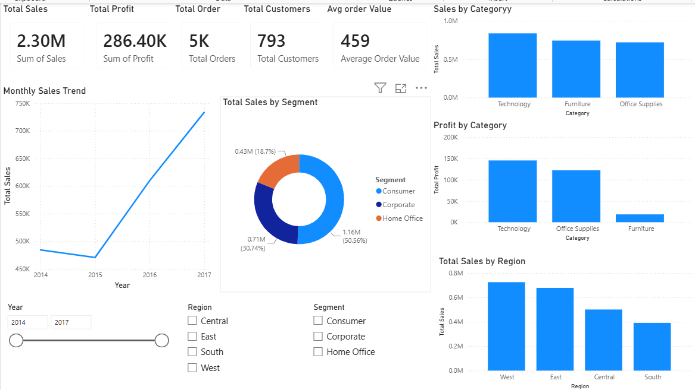
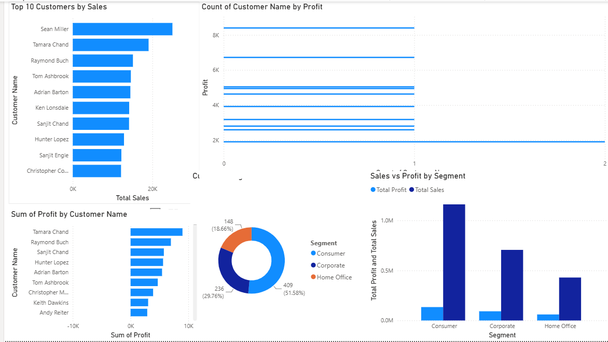
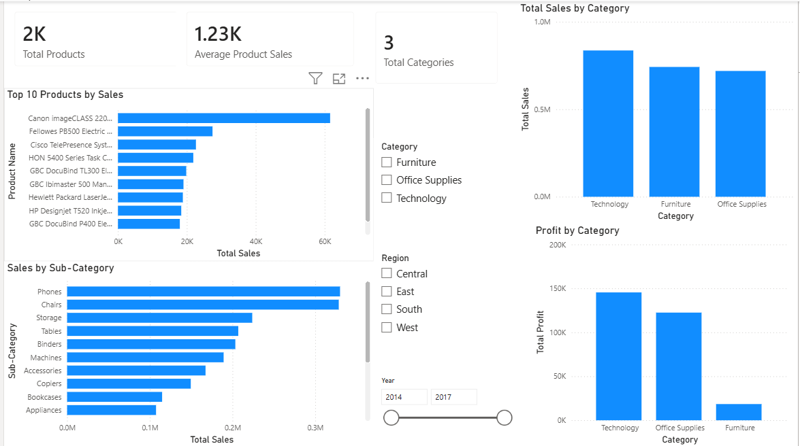
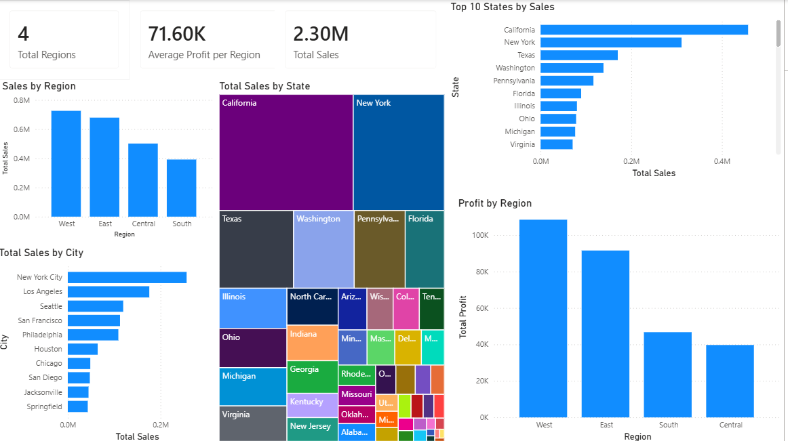
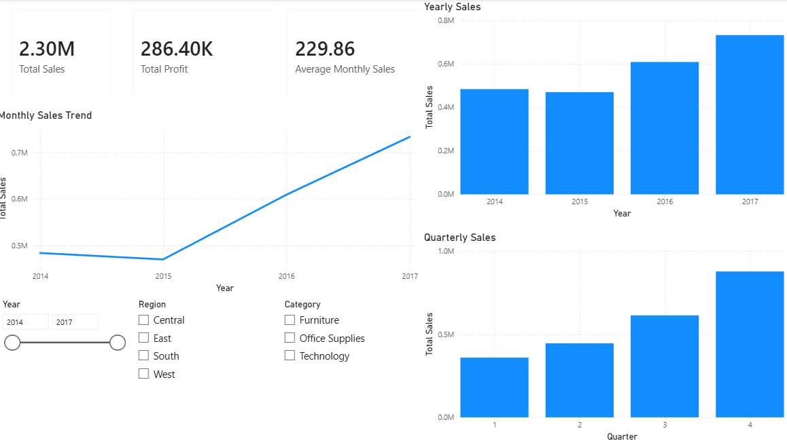

# 📊 Retail Sales & Business Intelligence Dashboard

An end-to-end Business Intelligence project built using **Python, SQL, PostgreSQL, Machine Learning, and Power BI** to analyze retail sales data and provide actionable business insights.

---

# 🚀 Project Overview

This project demonstrates the complete data analytics workflow:

- Data Cleaning
- Exploratory Data Analysis (EDA)
- SQL Analysis
- Machine Learning Sales Forecasting
- Interactive Power BI Dashboard

The objective is to help business stakeholders understand sales performance, customer behavior, regional trends, and product profitability.

---

# 🛠️ Tech Stack

- Python
- Pandas
- NumPy
- Matplotlib
- Seaborn
- PostgreSQL
- SQL
- Scikit-learn
- Power BI
- Git
- GitHub

---

# 📂 Project Structure

```text
Retail-Sales-BI-Dashboard
│
├── data
├── notebooks
├── dashboard
├── sql
├── reports
├── images
├── README.md
└── requirements.txt
```

---

# 📊 Dashboard Pages

- Executive Dashboard
- Customer Dashboard
- Product Dashboard
- Regional Dashboard
- Sales Forecast Dashboard

---

# 📈 Key Business Insights

- Technology category generated the highest revenue.
- Consumer segment contributed the largest share of sales.
- West region recorded the highest sales.
- California was the top-performing state.
- Random Forest produced better forecasting performance than Linear Regression.

---

# 📷 Dashboard Preview

## Executive Dashboard



## Customer Dashboard



## Product Dashboard



## Regional Dashboard



## Sales Forecast Dashboard



---

# ⚙️ Installation

Clone the repository:

```bash
git clone https://github.com/aatirhashmi19/Retail-Sales-BI-Dashboard.git
```

Install dependencies:

```bash
pip install -r requirements.txt
```

Launch Jupyter Notebook:

```bash
jupyter notebook
```

---

# 👨‍💻 Author

**Aatir Hashmi**
